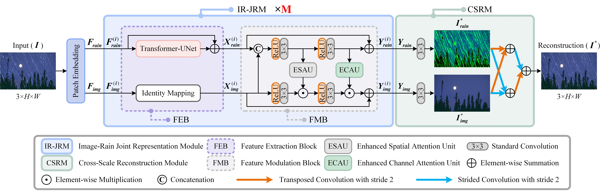
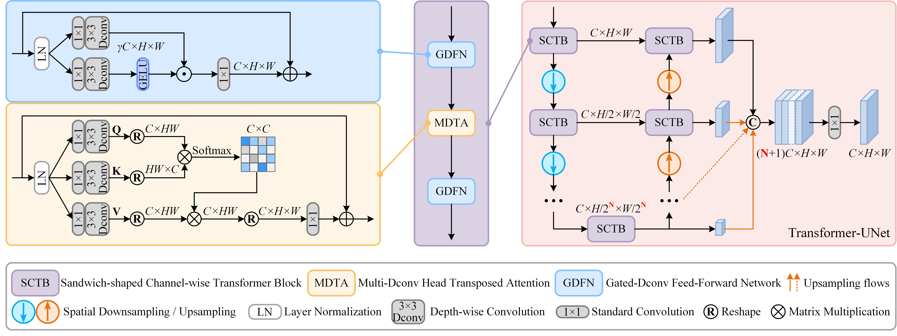
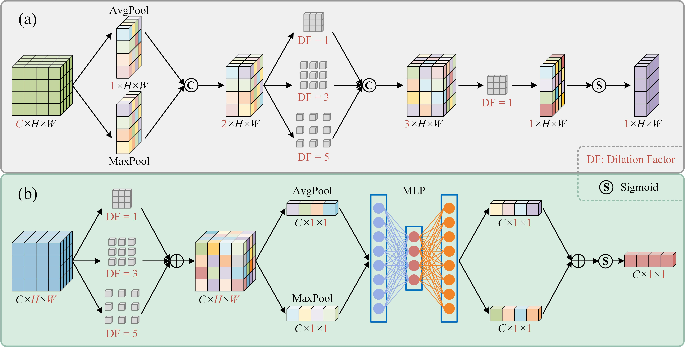

# PMDNet: Progressive modulation network with global-local representations for single image deraining (ESWA 2026)

[Yihao Ni](https://orcid.org/0009-0008-1656-7091) and [Shan Gai](https://orcid.org/0000-0001-6139-1410)

[Paper Download](https://www.sciencedirect.com/science/article/pii/S0957417425045257)

> **Abstract:** *Images captured under adverse weather conditions such as rainfall suffer from severe quality degradation, which subsequently impacts the performance of numerous vision-oriented systems. As a potential remedy, we propose an advanced progressive modulation network, named PMDNet, for single image deraining. The proposed method attains exceptional rain removal performance through three pivotal designs: 1) a dual-branch framework is employed to jointly optimize rain residuals and background images, which exploits degradation priors by modulating rain-free features with rain features; 2) the integration of Transformer and convolutional neural network (CNN) paradigms allows the model to combine their complementary strengths and to balance both global and local representations; 3) a novel sandwich-shaped Transformer architecture (i.e., placing self-attention between two feed-forward networks) and dilated convolutions with varying dilation factors are introduced to respectively enhance the effectiveness of self-attention and convolutional attention mechanisms, thereby facilitating more refined rain feature extraction and rain-free feature modulation. Extensive experiments conducted on synthetic rain streak/rain-fog/raindrop datasets, real rain samples, snowy scenes, as well as low-light conditions demonstrate the superiority and extensibility of our proposed method. The source code is available at https://github.com/N-yh/PMDNet.* 

## Network Architecture
<table>
  <tr>
    <td align="center">
      
      <p><b>Overall Architecture of PMDNet</b></p>
    </td>
  </tr>
  <tr>
    <td align="center">
      
      <p><b>Transformer-UNet</b></p>
    </td>
  </tr>
  <tr>
    <td align="center">
      
      <p><b>Enhanced Spatial and Channel Attention</b></p>
    </td>
  </tr>
</table>

## Installation
The model is built in PyTorch 1.13.1, Python3.7, CUDA11.6.

For installing, follow these intructions
```
conda create -n pmdnet_env python=3.7
conda activate pmdnet_env
conda install pytorch=1.13.1 torchvision=0.14.1 cudatoolkit=11.6 -c pytorch
pip install matplotlib scikit-image opencv-python yacs joblib natsort h5py tqdm pyyaml einops thop
```

Install warmup scheduler

```
cd pytorch-gradual-warmup-lr; python setup.py install; cd ..
```

## Quick Test

To test the pre-trained models on your own images with a specific resolution of even × even, run 
```
python test_1.py  
```
else run
```
python test_2.py  
```

## Training and Evaluation

### Training
- Download the [Datasets](Datasets/README.md)

- Train the model with default arguments by running

```
python train.py
```


### Evaluation

- Download the [models](https://pan.baidu.com/s/1X4JmIPwp4RZ1wbxoAIm8Iw) (**PWD: c62t**) and place it in `./checkpoints/`

- Download test datasets from [here](Datasets/README.md) and place them in `./Datasets/`

- Run
```
python test_1.py / python test_2.py
```

## Results
Experiments are performed for different image restoration tasks including, image deraining, image desnowing and low-light image enhancement.

## Acknowledgements
Code borrows from [MFDNet](https://github.com/qwangg/MFDNet) and [MPRNet](https://github.com/swz30/MPRNet). Thanks for sharing!

## Citation
If you use PMDNet, please consider citing:
~~~
@article{Ni2026PMDNet,
    title = {PMDNet: Progressive modulation network with global-local representations for single image deraining},
    journal = {Expert Systems with Applications},
    volume = {306},
    pages = {130910},
    year = {2026},
    author = {Yihao Ni and Shan Gai}
}
~~~
## Contact
Should you have any question, please contact nyhao@stumail.ysu.edu.cn.

